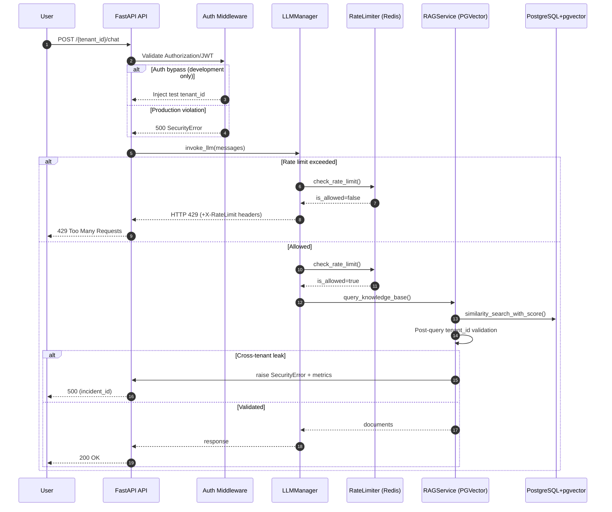

# End-to-End Flow

This sequence shows the main request path for a multi-tenant chat request, including authentication, rate limiting, RAG validation, and response handling.

References
- Auth validation: `backend/src/middleware/auth.py`
- Rate limiting: `backend/src/services/llm_manager.py`, `backend/src/utils/rate_limiter.py`
- RAG validation: `backend/src/services/rag_service.py`
- Metrics: `backend/src/utils/metrics.py`
