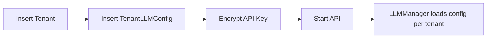

# Tenant Configuration Guide

This guide explains how to configure tenants, LLM providers, and rate limits.

Key Concepts
- Tenant record: `tenants` table via `backend/src/models/tenant.py`.
- LLM configuration: `tenant_llm_configs` with encrypted API key, model, and rate limits.
- Environment settings: `backend/src/config.py` (Pydantic Settings).

Steps
1. Create a tenant (via API or DB): name, domain, status.
2. Insert a row in `tenant_llm_configs`:
   - `llm_model_id`: references `llm_models`.
   - `encrypted_api_key`: use your KMS or `fernet` to encrypt.
   - `rate_limit_rpm`, `rate_limit_tpm`: per‑tenant limits.
3. Set environment variables in `.env`:
   - `ENVIRONMENT`, `DATABASE_URL`, `REDIS_URL`, `JWT_PUBLIC_KEY`, `FERNET_KEY`.
4. Restart the API service.

Notes
- Rate limiting headers: `X-RateLimit-Limit-RPM`, `X-RateLimit-Limit-TPM` are returned on 429 responses.
- `LLMManager` caches clients per tenant; use `llm_manager.clear_cache()` after model changes.

References
- `backend/src/models/tenant_llm_config.py`
- `backend/src/models/llm_model.py`
- `backend/src/services/llm_manager.py`
- `backend/src/config.py`
