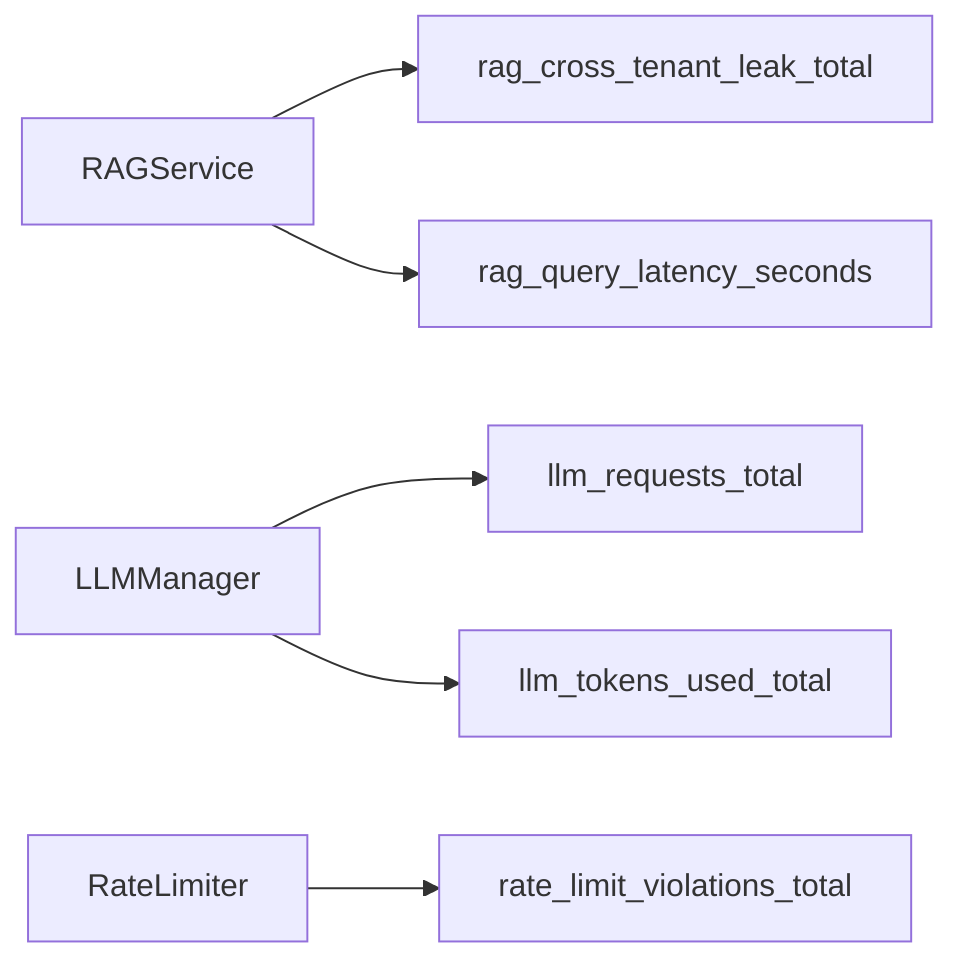

# Monitoring & Alerting

This guide summarizes Prometheus metrics exposed by the system and suggested alerts.

Metrics
- `rag_cross_tenant_leak_total{tenant_id, leak_source}` — Security violations detected by RAG post‑validation.
- `llm_requests_total{tenant_id, model}` — Total LLM requests per tenant and model.
- `llm_tokens_used_total{tenant_id}` — Total tokens consumed by LLM calls.
- `rate_limit_violations_total{tenant_id, type}` — RPM/TPM limit violations.
- `rag_query_latency_seconds{tenant_id}` — RAG query latency histogram.

Alerting Suggestions
- Leak detected: `rag_cross_tenant_leak_total > 0` (critical).
- Excessive rate limit violations: `rate_limit_violations_total > 100/hour` per tenant.
- Elevated 429s: percentage of 429 responses > 10%.
- High RAG latency: `rag_query_latency_seconds{quantile="0.95"} > 5s`.

References
- `backend/src/utils/metrics.py`
