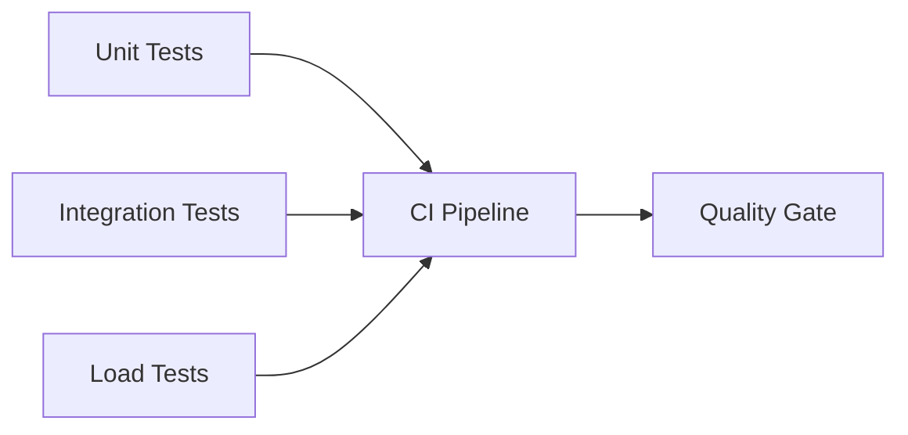

# Testing Strategy

This guide outlines unit, integration, and load testing focus areas.

Scope
- Unit tests: auth settings validation, middleware behavior, RAG validation, rate limiter logic.
- Integration tests: multi-tenant isolation, RAG pipeline, supervisor routing.
- Load tests: RPM/TPM enforcement, query latency under load.

Execution
- Unit/Integration: `pytest -q` (use `pytest-asyncio` for async routes).
- Load: k6 or Locust scenarios for chat endpoints and RAG queries.

Suggested Cases
- Auth
  - DISABLE_AUTH=true + ENVIRONMENT=production → ValueError.
  - Middleware rejects bypass in production.
- RAG
  - All docs match tenant → success.
  - Cross-tenant doc → `SecurityError` and metric increment.
  - Fail-open mode filters invalid docs.
- Rate limiting
  - RPM: 61 requests/minute → 429.
  - TPM: request exceeding tokens → 429 (with headers).
- Supervisor/Tools
  - Auto-discovery loads tools without code changes.
  - Routing prompt behaves for single/multi/unclear intent.

