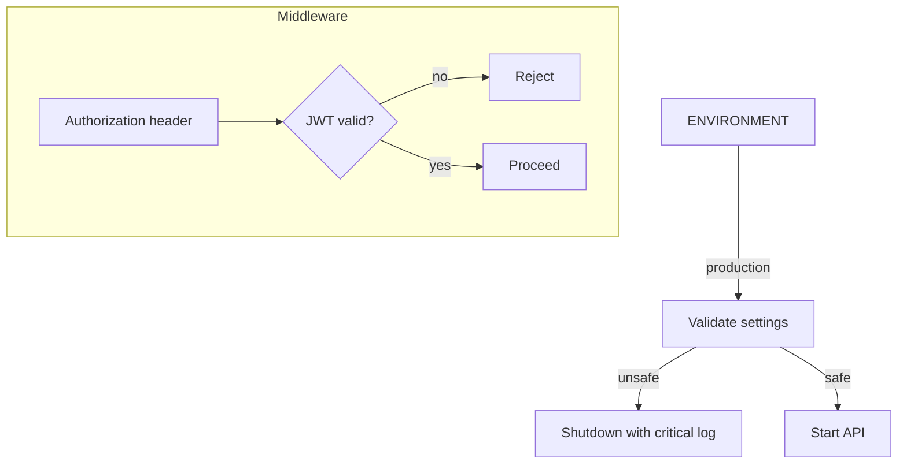

# Security Model

This document summarizes authentication controls, production safeguards, and security error handling.

Auth & Environment Controls
- `DISABLE_AUTH` is blocked in production (`backend/src/config.py` validator).
- Middleware rejects auth bypass at runtime in production; development may inject a test tenant for local testing.
- Startup validation prevents unsafe production configs (missing `JWT_PUBLIC_KEY`, `DISABLE_AUTH=true`).

Security Errors
- Security violations raise `SecurityError` (500 with `incident_id`).
- Critical events are logged with context and do not leak details to clients.

References
- `backend/src/config.py`
- `backend/src/middleware/auth.py`
- `backend/src/main.py`
