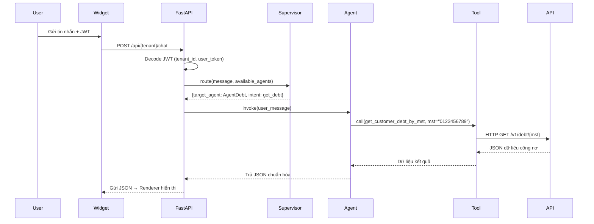
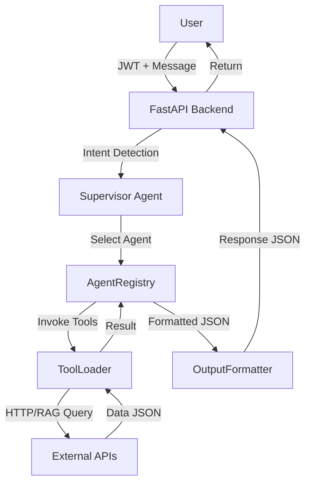

# 🧾 BẢN ĐẶC TẢ NGHIỆP VỤ – AGENTHUB CHATBOT (LangChain Architecture)

## 1. Thông tin chung
| Mục | Nội dung |
|------|-----------|
| **Tên hệ thống** | AgentHub Multi-Agent Chatbot Framework |
| **Phiên bản** | v2.0 (pgvector migration) |
| **Công nghệ** | LangChain 0.3+, FastAPI, PostgreSQL 15+ with pgvector, Redis 7.x, sentence-transformers |
| **Mục tiêu** | Xây dựng chatbot đa nghiệp vụ, cho phép người dùng và doanh nghiệp tương tác qua ngôn ngữ tự nhiên để truy xuất, xử lý và hiển thị dữ liệu nội bộ (ERP, CRM, eFMS, eTMS...). |
| **Đặc điểm nổi bật** | Config-driven, Multi-Agent, Multi-Tenant, Dynamic Tool Loading, JWT-secured, Structured Output, pgvector RAG |

---

## 2. Cấu trúc hệ thống (High-level Overview)
```
User → Widget / API
      ↓
SupervisorAgent (Intent Routing)
      ↓
Domain Agents (Debt, Shipment, OCR, Analysis)
      ↓
ToolLoader (HTTPGetTool / RAGTool / DBQueryTool)
      ↓
Backend API / Knowledge Base
      ↓
OutputFormatter → Renderer (UI)
```

---

## 3. Thành phần kiến trúc
| Thành phần | Vai trò | Công nghệ | File |
|-------------|----------|------------|------|
| **Frontend Widget** | Giao diện chat nhúng, gửi JWT + message đến backend | HTML/JS + postMessage | `test-chatbot.html` |
| **FastAPI Backend** | API trung gian điều phối giữa user, supervisor, và agents | FastAPI (async) | `src/main.py`, `src/api/` |
| **SupervisorAgent** | Phân tích intent + entity, chọn agent phù hợp | LangChain + LLM | `src/services/supervisor_agent.py` |
| **Domain Agents** | Xử lý nghiệp vụ, reasoning và gọi tools | LangChain AgentExecutor | `src/services/domain_agents.py` |
| **ToolLoader** | Khởi tạo công cụ động từ DB (HTTP, RAG, DB...) | LangChain Tool + Pydantic | `src/services/tool_loader.py` |
| **RAG Service** | Quản lý knowledge base với pgvector | PostgreSQL pgvector + embeddings | `src/services/rag_service.py` |
| **LLM Manager** | Quản lý model (GPT, Gemini, OpenRouter), decrypt API keys | LangChain LLMs + Fernet | `src/services/llm_manager.py` |
| **Embedding Service** | Generate embeddings cho RAG | sentence-transformers (all-MiniLM-L6-v2, 384d) | `src/services/embedding_service.py` |
| **Redis** | Cache cấu hình agent & session | Redis 7.x | `src/services/cache_service.py` |
| **PostgreSQL** | Lưu cấu hình agent/tool/tenant, hội thoại, pgvector | Async SQLAlchemy 2.0+ | `src/models/`, 13 tables |
| **pgvector** | Vector similarity search cho RAG (thay ChromaDB) | PostgreSQL extension, HNSW index | `knowledge_documents` table |

---

## 4. Mô hình dữ liệu chính (13 bảng)

### Core Tables
| Bảng | Vai trò | File Model | Quan hệ |
|-------|----------|------------|----------|
| `tenants` | Tổ chức sử dụng hệ thống | `src/models/tenant.py` | Root của multi-tenancy |
| `llm_models` | Danh sách model có sẵn (GPT, Gemini, Claude...) | `src/models/llm_model.py` | `agent_configs.llm_model_id` |
| `tenant_llm_configs` | Config LLM theo tenant + encrypted API key | `src/models/tenant_llm_config.py` | FK `llm_model_id`, FK `tenant_id` (unique) |

### Agent & Tool Configuration
| Bảng | Vai trò | File Model | Quan hệ |
|-------|----------|------------|----------|
| `base_tools` | Định nghĩa loại tool (HTTP, RAG, SQL, OCR...) | `src/models/base_tool.py` | `tool_configs.base_tool_id` |
| `tool_configs` | Tool cụ thể (endpoint, schema, headers...) | `src/models/tool.py` | `agent_tools.tool_id` |
| `agent_configs` | Định nghĩa từng Agent (prompt, llm_model, tool_ids, output_format) | `src/models/agent.py` | `tenant_agent_permissions.agent_id` |
| `agent_tools` | Junction M:N giữa agent và tool + priority | `src/models/agent.py` (AgentTools) | PK compound (agent_id, tool_id) |
| `output_formats` | Chuẩn hóa format kết quả và renderer hint | `src/models/output_format.py` | FK `tool_configs.output_format_id` |

### Permissions (Multi-Tenant Access Control)
| Bảng | Vai trò | File Model | Quan hệ |
|-------|----------|------------|----------|
| `tenant_agent_permissions` | Quyền agent theo tenant + optional output override | `src/models/permissions.py` | PK compound (tenant_id, agent_id) |
| `tenant_tool_permissions` | Quyền tool theo tenant | `src/models/permissions.py` | PK compound (tenant_id, tool_id) |

### Runtime (Conversations)
| Bảng | Vai trò | File Model | Quan hệ |
|-------|----------|------------|----------|
| `sessions` | Phiên hội thoại + thread_id for LangGraph | `src/models/session.py` | FK `tenant_id`, FK `agent_id` (optional) |
| `messages` | Tin nhắn trong hội thoại + metadata (tool_calls, llm) | `src/models/message.py` | FK `session_id` |
| `checkpoints` | LangGraph state persistence (optional) | N/A (LangChain managed) | FK `thread_id` |

### Knowledge Base (pgvector)
| Bảng | Vai trò | Công nghệ | Quan hệ |
|-------|----------|------------|----------|
| `knowledge_documents` | Vector embeddings + content cho RAG | pgvector extension, HNSW index | FK `tenant_id` (metadata filtering) |
| | Attributes: `id`, `tenant_id`, `document_id`, `content`, `embedding` (vector[384]), `metadata` (JSONB) | sentence-transformers | Cosine similarity search |

### Widget Configuration
| Bảng | Vai trò | File Model | Quan hệ |
|-------|----------|------------|----------|
| `tenant_widget_configs` | Cấu hình widget nhúng (iframe) theo tenant | `src/models/tenant_widget_config.py` | FK `tenant_id` (unique) |

---

## 5. Luồng hoạt động chatbot


---

## 6. Flow xử lý tin nhắn (Handle Message) - THỰC TẾ

| Bước | Mô tả | File thực hiện | Code Reference |
|-------|-------|----------------|----------------|
| ① | Nhận POST /api/{tenant_id}/chat với {message, session_id?, user_id} | `src/api/chat.py` | `chat_endpoint()` line 22-184 |
| ② | Validate JWT (RS256) + extract tenant_id | `src/middleware/auth.py` | `get_current_tenant()` |
| ③ | Validate tenant exists in DB | `src/api/chat.py` | Query `tenants` table line 48-50 |
| ④ | Get or create session + generate thread_id | `src/api/chat.py` | `_get_or_create_session()` line 187-253 |
| ⑤ | Save user message to messages table | `src/api/chat.py` | INSERT messages line 64-72 |
| ⑥ | Initialize SupervisorAgent + load available agents | `src/services/supervisor_agent.py` | `__init__()` line 38-58, `_load_available_agents()` |
| ⑦ | Supervisor detects intent via LLM | `src/services/supervisor_agent.py` | `_detect_intent()` line 160-210, calls LLM with agent list |
| ⑧ | Route to DomainAgent nếu single intent | `src/services/supervisor_agent.py` | `route_message()` line 60-137, `AgentFactory.create_agent()` |
| ⑨ | DomainAgent: Load config + LLM + tools from DB | `src/services/domain_agents.py` | `__init__()` line 18-65, query agent_configs, load tools via tool_loader |
| ⑩ | Extract entities from user message via LLM | `src/services/domain_agents.py` | `_extract_intent_and_entities()` line 138-182, dynamic prompt from input_schema |
| ⑪ | Execute tool if entities complete | `src/services/domain_agents.py` | `invoke()` line 184-300+, tool.invoke() with extracted params |
| ⑫ | Tool execution (HTTP/RAG/DB) | `src/tools/rag.py`, `src/tools/http.py` | RAGTool: query pgvector with tenant_id filter |
| ⑬ | Format response theo output_format | `src/utils/formatters.py` | `format_agent_response()` applies output_formats table schema |
| ⑭ | Save assistant message + metadata | `src/api/chat.py` | INSERT messages with metadata (tool_calls, llm_model) line 97-116 |
| ⑮ | Return ChatResponse JSON | `src/api/chat.py` | Return ChatResponse line 159-168 |

---

## 7. Service Architecture (Thực tế triển khai)

| Service | Vai trò | File | Key Methods |
|---------|----------|------|-------------|
| **SupervisorAgent** | Intent routing, multi-language detection | `src/services/supervisor_agent.py` | `route_message()`, `_detect_intent()`, `_load_available_agents()` |
| **AgentFactory** | Tạo DomainAgent instance từ config DB | `src/services/domain_agents.py` | `create_agent(agent_name, tenant_id)` |
| **DomainAgent** | Entity extraction + tool calling + response gen | `src/services/domain_agents.py` | `invoke()`, `_extract_intent_and_entities()`, `_build_entity_extraction_prompt()` |
| **LLMManager** | Quản lý LLM (GPT, Gemini, OpenRouter), decrypt keys | `src/services/llm_manager.py` | `get_llm_for_tenant()`, decrypt Fernet API keys |
| **ToolLoader** | Load tools từ DB với priority + permissions | `src/services/tool_loader.py` | `load_agent_tools()`, query tool_configs + agent_tools + permissions |
| **RAGService** | Quản lý pgvector knowledge base | `src/services/rag_service.py` | `search()`, `ingest_documents()`, pgvector similarity search |
| **EmbeddingService** | Generate embeddings (sentence-transformers) | `src/services/embedding_service.py` | Singleton, cached model all-MiniLM-L6-v2 (384d) |
| **DocumentProcessor** | Extract text từ PDF/DOCX/TXT, chunking | `src/services/document_processor.py` | `process_document()`, semantic chunking 512 tokens |
| **ConversationMemory** | Load message history từ DB | `src/services/conversation_memory.py` | `get_conversation_history(session_id)` |
| **OutputFormatter** | Apply output_formats table schema | `src/utils/formatters.py` | `format_agent_response()`, `format_clarification_response()` |

---

## 8. Output Format & Rendering
| Thành phần | Vai trò | Ví dụ |
|-------------|----------|--------|
| **output_formats** | Chuẩn hóa cấu trúc dữ liệu output | structured_json, markdown_table, chart_data |
| **tool_configs.output_format_id** | Tool chọn format mặc định | FK → output_formats.id |
| **agent_configs.default_output_format_id** | Agent fallback format | structured_json |
| **tenant_agent_permissions.output_override_id** | Tenant override format | chart_data (tùy chọn) |
| **renderer_hint** | Hướng dẫn UI render | {"type": "table", "fields": ["col1","col2"]} |

---

## 9. JWT & Bảo mật
| Thành phần | Mô tả |
|-------------|--------|
| **JWT Decode** | Giải mã `tenant_id`, `user_id`, `access_token` |
| **Context Passing** | Truyền `user_token` vào tool context |
| **Secure Headers** | Tool tự thêm `Authorization: Bearer <user_token>` khi gọi API |
| **Tenant Isolation** | Redis + DB namespaced theo tenant |
| **Key Management** | API key được mã hóa bằng Fernet trong DB |

---

## 10. Flow runtime (tổng thể)


---

## 11. Đặc tả nghiệp vụ cụ thể
| Nghiệp vụ | Agent | Tool | Output |
|------------|--------|-------|---------|
| **Tra cứu công nợ** | AgentDebt | get_customer_debt_by_mst, get_salesman_debt | structured_json |
| **Theo dõi vận đơn** | AgentShipment | get_shipment_status | structured_json |
| **OCR File** | AgentOCR | extract_text_from_image | summary_text |
| **Phân tích dữ liệu** | AgentAnalysis | search_knowledge, query_db | chart_data |

---

## 12. Luồng dữ liệu backend (Data Layer)
| Giai đoạn | Nguồn | Mục đích |
|------------|--------|-----------|
| Base Setup | `base_tools`, `output_formats`, `llm_models` | Tạo nền tảng hệ thống |
| Agent Setup | `agent_configs`, `agent_tools` | Khai báo domain agent |
| Tenant Setup | `tenant_agent_permissions`, `tenant_llm_configs` | Bật agent & model cho tenant |
| Runtime | Redis cache, LangChainFactory | Sinh LLM, Tool, Agent instance |
| Session | PostgreSQL, Redis | Lưu hội thoại & context |

---

## 13. Chiến lược mở rộng (Thực tế)

| Mục tiêu | Cách thực hiện | API Endpoint | Ghi chú |
|-----------|----------------|--------------|---------|
| ➕ Thêm Agent mới | POST /admin/agents với config JSON | `src/api/admin/agents.py` | Insert agent_configs, specify llm_model_id + prompt_template |
| ➕ Thêm Tool mới | POST /admin/tools với base_tool_id + config | `src/api/admin/tools.py` | Insert tool_configs (endpoint, input_schema, output_format_id) |
| ➕ Assign Tool cho Agent | Insert agent_tools với priority | Database direct hoặc admin API | priority: 1=highest, controls tool loading order |
| ➕ Bật Agent cho Tenant | Insert tenant_agent_permissions (enabled=true) | `src/api/admin/agents.py` | Optional: output_override_id for custom format |
| ➕ Bật Tool cho Tenant | Insert tenant_tool_permissions (enabled=true) | `src/api/admin/tools.py` | Required for tool to appear in agent's tool list |
| 🔄 Reload Agent | Đợi Redis cache TTL expire (1 giờ) hoặc restart | N/A | CHƯA CÓ real-time invalidation, depends on cache TTL |
| 🧩 Upload Knowledge Doc | POST /admin/knowledge/upload (PDF/DOCX/TXT) | `src/api/admin/knowledge.py` | Auto-chunk + embed + store pgvector |
| 📊 Tracking | messages.metadata lưu tool_calls, llm_model, tokens | `src/api/chat.py` line 102-114 | Metadata tracked nhưng CHƯA CÓ usage_metrics table |

---

## 14. Tổng kết nghiệp vụ
| Tầng | Mô tả | Thực hiện |
|------|-------|-------------|
| **SupervisorAgent** | Xác định domain (AgentDebt, Shipment, Analysis...) | LLM nhỏ (GPT-4o-mini) |
| **Domain Agent** | Reasoning + Tool calling | LangChain AgentExecutor |
| **Tool** | Thực thi tác vụ thật (HTTP, SQL, OCR, RAG) | LangChain Tool |
| **Formatter** | Chuẩn hóa kết quả JSON | OutputFormatter |
| **Widget/UI** | Hiển thị bảng, chart, text | React/Vue |

---

## 15. Mục tiêu thành công (Success Metrics) - HIỆN TẠI

| Tiêu chí | Mục tiêu | Thực tế | Ghi chú |
|-----------|-----------|---------|---------|
| **Response time** | < 2.5s | ✅ Measured in chat.py line 124-145 | Warning log if > 2.5s |
| **Cache hit rate** | > 90% | ⚠️ CHƯA ĐO (no Redis caching implemented yet) | Planned for next sprint |
| **JWT validation** | < 50ms | ✅ Middleware validation | RS256 signature check |
| **Uptime** | > 99.9% | 🔄 Production monitoring | Docker + health check endpoint |
| **New agent setup** | < 5 phút | ✅ Via admin API | POST /admin/agents + permissions |
| **Tool reuse rate** | > 70% | 📊 Not tracked | Need analytics implementation |
| **pgvector search** | < 100ms | ✅ HNSW index | Cosine similarity with tenant_id filter |
| **Multi-tenant isolation** | 100% | ✅ Application-level | RLS not implemented (planned improvement) |

---

## 16. Hiện trạng & Kế hoạch cải tiến

### ✅ Đã triển khai (v2.0)
- Multi-agent architecture với SupervisorAgent routing
- Database-driven configuration (agent_configs, tool_configs, permissions)
- Multi-tenancy với tenant_id isolation (application-level)
- JWT authentication (RS256) + Fernet encrypted API keys
- pgvector RAG với sentence-transformers embeddings (384d)
- Dynamic tool loading với priority ordering
- Structured output formats
- Conversation memory (sessions + messages tables)
- Admin API endpoints (agents, tools, knowledge upload)
- LLM manager hỗ trợ OpenAI, Anthropic, OpenRouter

### ⚠️ Limitations hiện tại
- **No Row-Level Security (RLS)**: Tenant isolation chỉ ở application layer, chưa có DB-level enforcement
- **No Redis caching**: Agent/tool configs đọc từ DB mỗi request (planned: cache với TTL 1h)
- **No real-time config updates**: Config changes cần cache expire hoặc restart
- **No audit logs**: Configuration changes không track who/what/when
- **No usage metrics table**: Token usage chỉ log, không persist vào DB
- **No tenant quotas**: Unlimited usage per tenant
- **No config versioning**: Không có rollback capability

### 🚀 Kế hoạch cải tiến (Sprint tiếp theo)
Xem chi tiết: `.specify/features/multi-tenant-db-security/spec.md`

**Priority 1 (Critical)**:
1. Implement Row-Level Security (RLS) policies cho tenant isolation
2. Add database constraints (CHECK, UNIQUE, FK cascades)
3. Add strategic indexes (composite, partial indexes)

**Priority 2 (High Value)**:
4. Implement Redis caching với pub/sub invalidation
5. Create audit_logs table with triggers
6. Add tenant_quotas table với enforcement triggers
7. Add usage_metrics table for cost tracking

**Priority 3 (Nice to Have)**:
8. Configuration versioning system
9. Real-time monitoring dashboard
10. A/B testing infrastructure

---

## 17. Tầm nhìn
> "AgentHub giúp doanh nghiệp trò chuyện với hệ thống của chính họ. Mỗi Agent là một domain thông minh – có thể tùy chỉnh, bảo mật, và mở rộng vô hạn."

**Last Updated**: 2025-11-06 (Updated to reflect pgvector migration + actual code structure)

